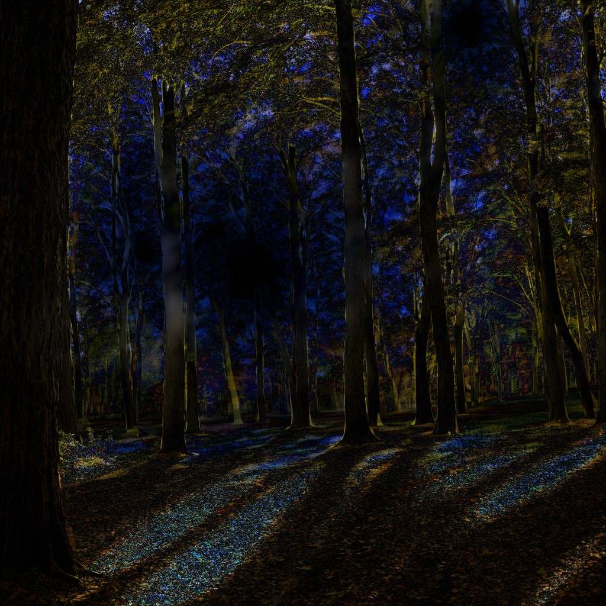
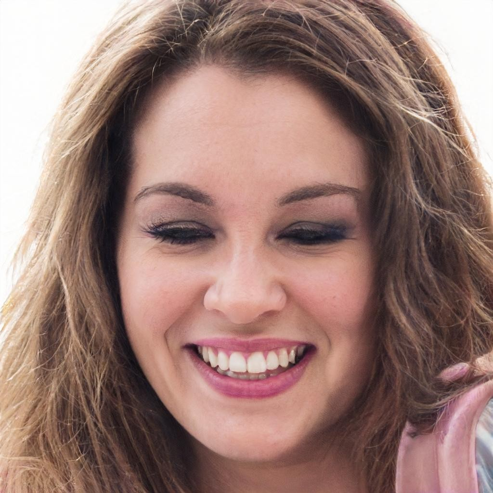
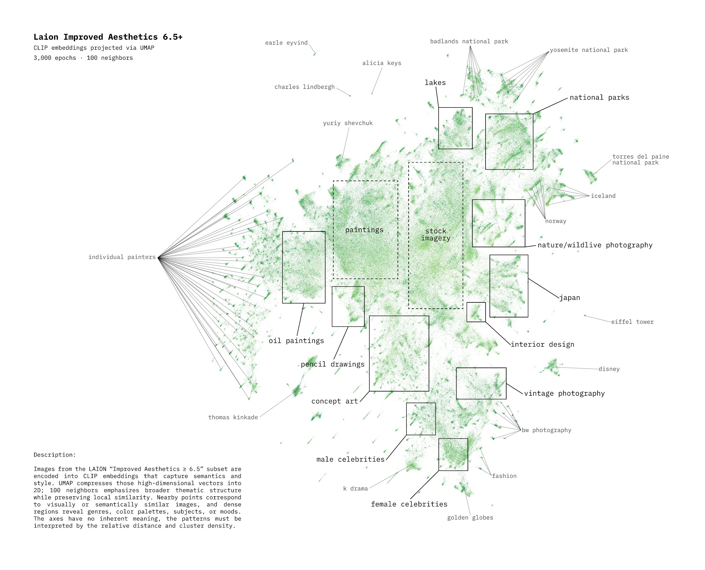
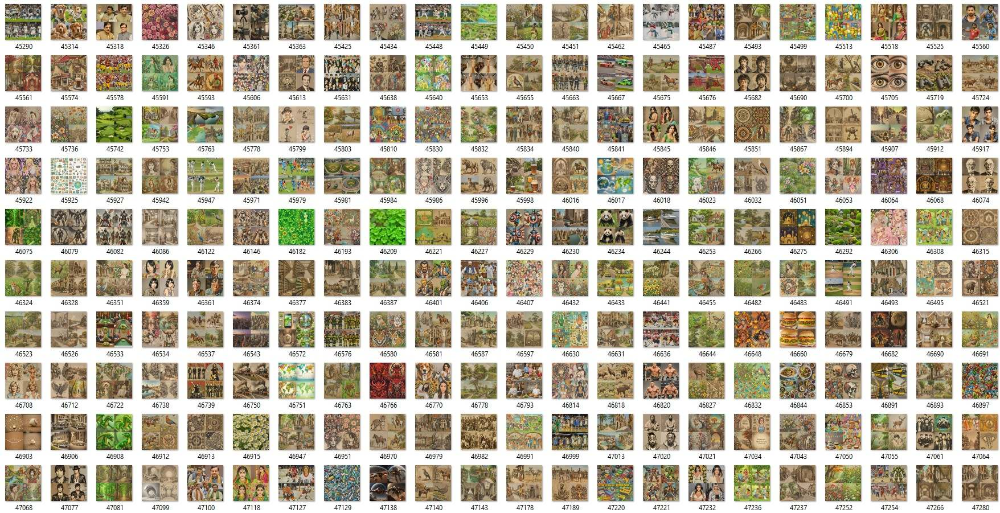
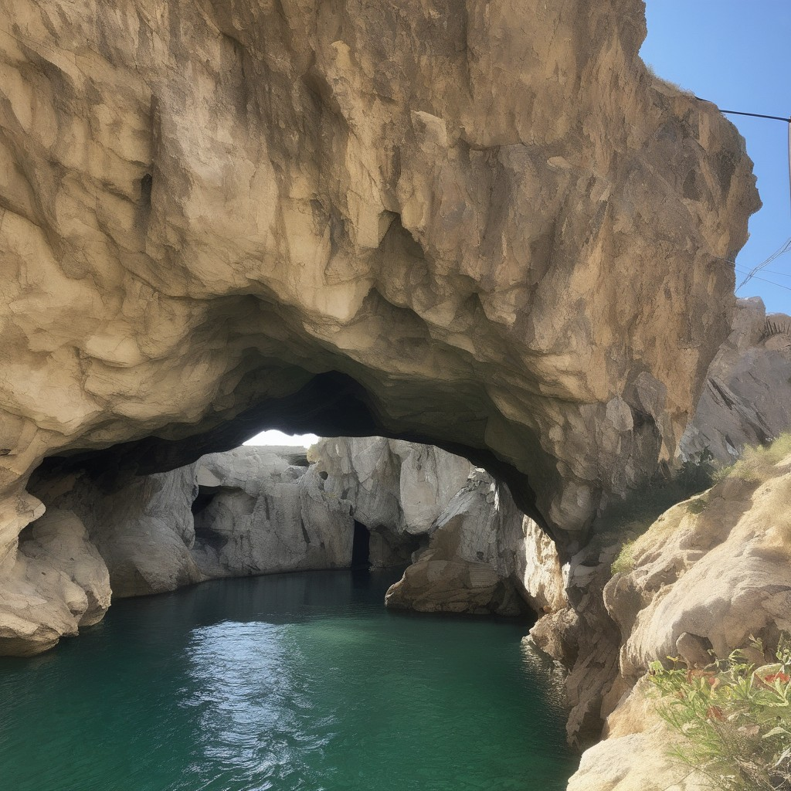

# Paranoia De-Prompting

**Artificial intelligence as artistic material.** Small experiments for looking
behind prompts: feedback, CLIP, tokens, embeddings, latent space, and accidental
images.

> The image is not only a result. The tokenizer, score, loop, and error are
> materials too.

## Start here

```bash
python -m venv .venv
source .venv/bin/activate
pip install -r requirements.txt
```

The first run downloads model weights from Hugging Face. Most CLIP examples run
on CPU; SDXL and evolutionary search expect CUDA.

## Field guide

| Question | Experiments | Notebook |
|---|---|---|
| What is the relation between text and image? | [CLIP](scripts/clip/README.md) | [0 · CLIP Intro](notebooks/0_CLIP_Intro.ipynb) |
| What happens when an image becomes its own input? | [Feedback loops](scripts/loops/README.md) | [1 · CLIP Loops](notebooks/1_CLIP_Loops.ipynb) |
| What does a prompt look like to a tokenizer? | [Tokens](scripts/tokens/README.md) | [2 · Tokens](notebooks/2_Tokens.ipynb) |
| Can a prompt be reconstructed without language? | [Evolution](scripts/evolution/README.md) | [3 · Evolution](notebooks/3_Evolution.ipynb) |
| What remains after repeated transformation? | [Complexity](scripts/complexity.py) | [4 · Complexity](notebooks/4_Complexity.ipynb) |
| Can meaning be drawn as a map? | [Embeddings](scripts/embeddings/README.md) | [5 · Text Embeddings](notebooks/5_Text_Embeddings.ipynb) |
| What does CLIP think it sees? | [Classification](scripts/classification/README.md) | [6 · Classification](notebooks/6_CLIP_Classification.ipynb) |
| What lives inside the token dictionary? | [Token map](scripts/token_map/README.md) | [7 · Token Map](notebooks/7_Token_Map.ipynb) |

All editable examples are indexed in [scripts/README.md](scripts/README.md).

## Feedback as method

| state `n` | state `n + 1` | difference |
|---|---|---|
|  |  |  |

`f(x) = f(f(x))`

> Generate an image based on the previous image. Repeat again.

Save every state. Watch model bias and residue accumulate. Treat drift as the
subject, not a defect: **an AI walking through latent space**.

## CLIP: machine description

<table>
  <tr>
    <th>Lower match</th>
    <th>Prompt</th>
    <th>Higher match</th>
  </tr>
  <tr>
    <td><br><code>20.67</code></td>
    <td><strong>Happy?</strong><br>Find the highest score</td>
    <td><br><code>24.01</code></td>
  </tr>
</table>

Portrait source: [`thispersondoesnotexist.com`](https://thispersondoesnotexist.com/)

CLIP places text and images in a shared comparison space. Scores are relative to
the candidates supplied—not truth, confidence, or calibrated probability.

## Cartography of AI



> High-dimensional space does not represent space.

UMAP compresses relationships into two dimensions. Nearby points may be
visually or semantically related; the axes have no inherent meaning.

## Token experiments



- Tokens are not words.
- Case, spacing, `</w>`, emoji, names, and web residue matter.
- The slides identify **3,832 tokenwords** ending in `</w>` that are absent from
  the English dictionary.

| token fragment | decoded residue | type |
|---|---|---|
| `thnkbigsundaywithmarsha</w>` | `thinkbigsundaywithmarsha` | word end |
| `internationalwomensday</w>` | `internationalwomensday` | word end |
| repeated encoded emoji bytes | repeated emoji | subword |

## Prompt reconstruction

**16 tokens · 200 iterations · population 2,048**

The genetic algorithm searches token sequences by CLIP similarity, then renders
them through SDXL. The resulting token language exposes alignment—and
misalignment—between model vocabularies.

Source image: [`https://picsum.photos/seed/42/1024/1024`](https://picsum.photos/seed/42/1024/1024)

Genetic token prompt:

```text
email defeats</w> wallart</w> cave</w> impacting</w> pi peoplesvote</w>
blames</w> mcclure</w> 🇺</w> croati desk</w> zazzle</w> numerous</w>
mediter eleng
```

Token IDs: `33537, 16317, 36223, 9654, 29359, 741, 45830, 27841, 44945, 39755, 28072, 6550, 47857, 17082, 14194, 48180`

<table>
  <tr>
    <th>Original</th>
    <th>Token prompt</th>
    <th>FLUX.1-dev</th>
    <th>SD 3.5 Medium</th>
    <th>SDXL Base 1.0</th>
    <th>SD v1.5</th>
  </tr>
  <tr>
    <td></td>
    <td><code>email defeats&lt;/w&gt; wallart&lt;/w&gt; cave&lt;/w&gt; impacting&lt;/w&gt; … mediter eleng</code></td>
    <td></td>
    <td></td>
    <td></td>
    <td></td>
  </tr>
</table>
